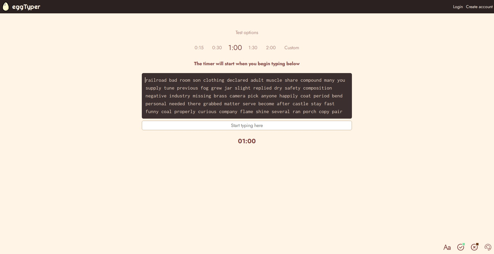
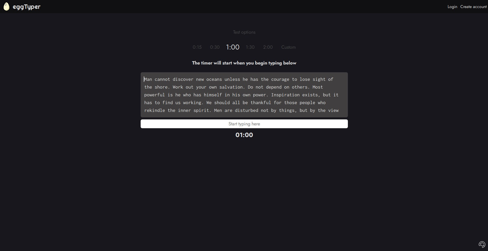

# eggTyper | A clean, simple typing speed tester

[Live link](https://eggtyper.netlify.app/)

## Major changes

- Rewritten using React and TypeScript (built with Vite)
- Performance improvements
- No test duration cap
- Customisable font size/correctness colours (using localStorage for persistence)
- Deployed via Netlify

## Planned features

- Additional themes
- User accounts

The old vanilla HTML/CSS/JS version is available at <https://maoshizhong.github.io/eggTyper/> for comparison.
