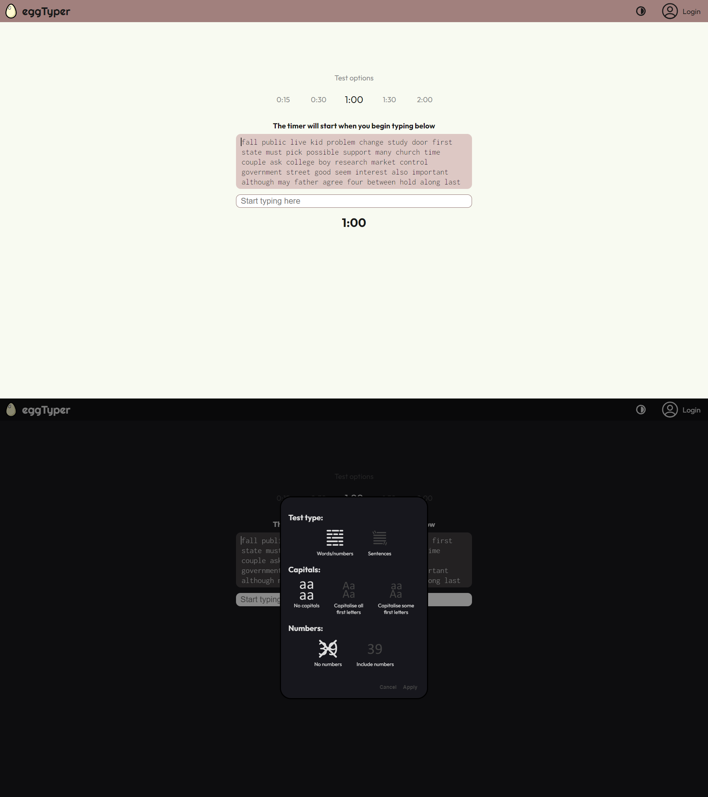

# Typing Speed Website (CS50x Final Project)

## eggTyper | A clean, simple typing speed tester
 

### Description:

This is eggTyper, inspired by an annoyance with the overabundance of ugly, cluttered typing speed websites out there (bar a few).

The project is front-end only and was created purely in HTML, CSS and JavaScript.

You are presented with a simple text display with a randomly generated list of words.
These words are the top 500 most common words found in the English language (source: https://www.wordfrequency.info/samples.asp - list 1, top 500 extracted with duplicates replaced by words immediately after #500).

Every time the site is reloaded or a test reset, these 500 words will be shuffled using the Fisher-Yates shuffle, then the first 250 words are taken and split into individual characters which are each then loaded into the display as their own div. 250 was chosen as with the max test duration of 2 minutes, it would be highly unlikely to go beyond this so for performance, 500 words were not required. Nonetheless, this can be adjusted should longer test durations be included.

Individual divs are added as opposed to the text box displaying a string so that individual character styles may be applied as well as the moving "cursor" (div border-left). This allows for dynamic visual feedback as you are typing, highlighting correct characters in blue, and highlighting incorrects in red (with a light red background for ease of viewing).

"Automatic" scrolling is a feature so that once you reach approx. halfway down the displayed words, the top line will shift up so you will always be able to see the words you are typing and what words are coming up. These hidden divs are not removed, so if you CTRL+A backspaced, all styles would be removed and you will return to the very start of that same list of words.

5 test durations are available (buttons disabled during and after a test, before reset button pressed). The timer and time limit were achieved via setTimeout() and setInterval().

Upon test end, the score is immediately presented along with a collapsible explanation div, detailing the calculation process. It was interesting learning exactly how WPM is defined, since words all vary in length, and corrected errors already penalise due to the time spent correcting.

Custom CSS variables also allowed for multiple themes, so a button to switch between light and dark themes is available.

Lastly, the site is for the most part, responsive on nearly all modern screen sizes, including smaller smartphones, as long as the screen is in landscape orientation (should someone wish to use an external keyboard with their phone screen).
 

### Development:
This project was developed entirely in VSCode (local) then imported into the CS50 codespace for submission. 
Extensions used (and learnt about) were PostCSS language support (for nested CSS syntax highlighting), PostCSS intellisense (as native intellisense does not work with the previous extension), and Live Server (for testing locally due to static HTML blocking ES6 modules for security).

In its current state, the website can easily be deployed publicly as it does not require a backend. However, there is easily scope to add backend support for user profiles, which will allow scope for additional features (e.g. additional test types (such as including punctuation, numbers or typing quotes/excerpts)).

 
 
Main skills learnt/practiced (relative to when the project began):

- Further practice with CSS flexbox/grid
- How WPM is actually calculated
- CSS custom variables
- Colour themes using these variables in a :root class selector
- Using SVGs and altering them in HTML
- Animated collapsible elements
- ES6 modules
- Issues with ES6 modules and running static HTML files in browser (need to use a live server)
- Shuffling arrays via the Fisher-Yates shuffle algorithm (and benefits over other, perhaps simpler shuffling algorithms, mainly performance as well as less permutation biases)
- Properties of e (e.g. `.inputType`)
- Difference in performance when creating and appending vast numbers of child elements via createElement()/appendChild vs template literals added to .innerHTML
- Settings timeouts and intervals, as well as clearing them

Now refactored to make use of Webpack5 and ES6 classes - improved scalability.