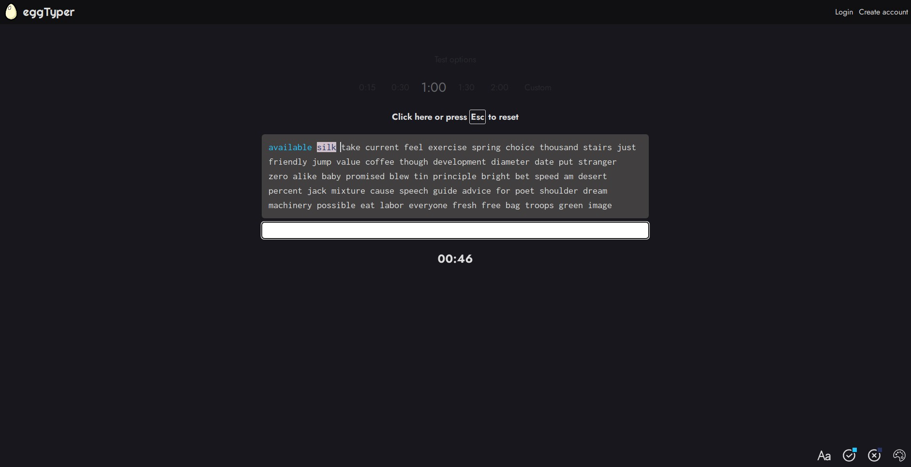

# eggTyper | A clean, simple typing speed tester

[Live link](https://eggtyper.netlify.app/)

## Major changes

- Rewritten using React and TypeScript (built with Vite)
- Performance improvements
- No test duration cap
- Deployed via Netlify

## Planned features

- Additional themes
- Customisable test font size
- Customisable correct/incorrect colours
- User accounts
- Account-based saved settings with localStorage fallback if not logged in

The old vanilla HTML/CSS/JS version is available at https://maoshizhong.github.io/eggTyper/
